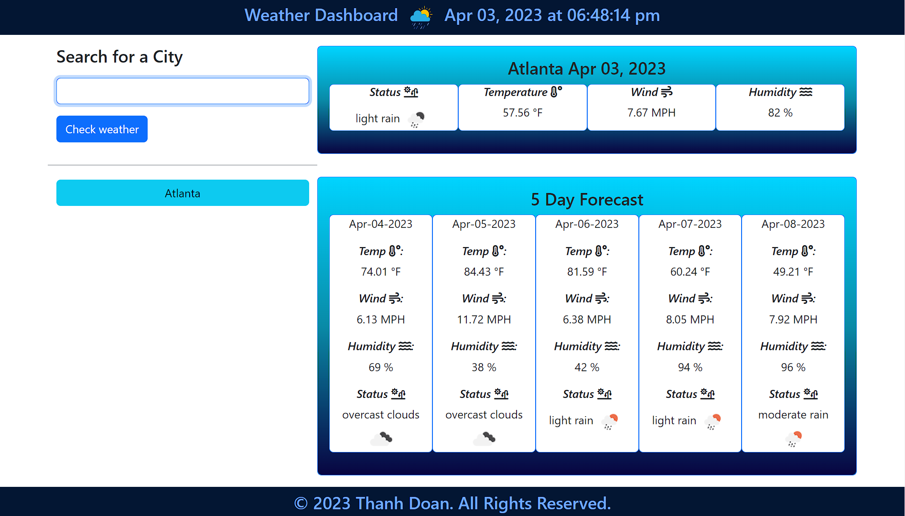
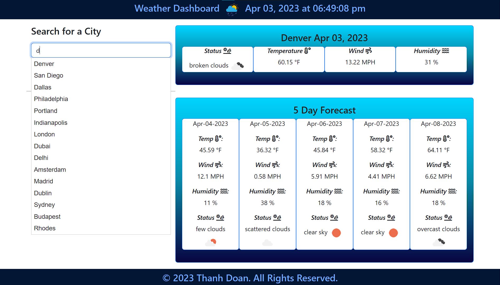
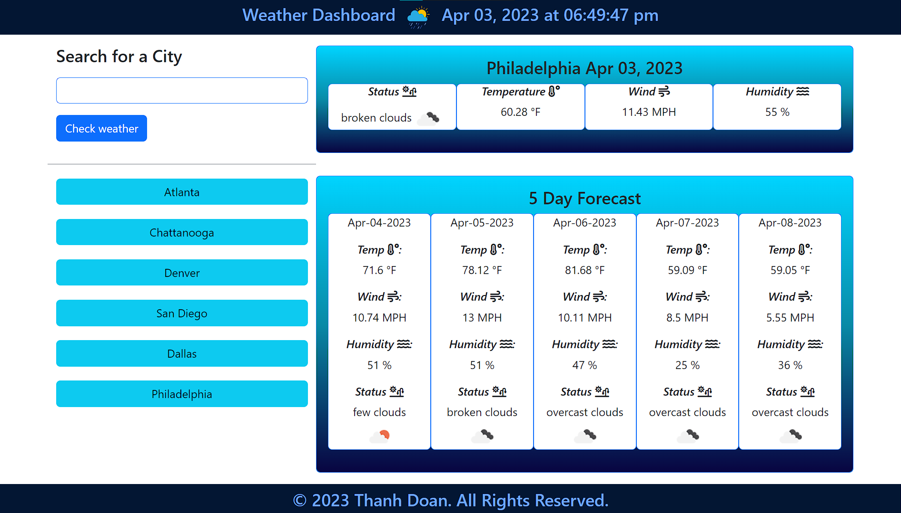

# Weather Dashboard
This is a Weather Dashboard with a 5-day weather forecast

<br>

## Table of Contents 
- [Description](#description)
- [Usage](#usage)
- [Links](#links)
- [Features](#features)
- [User Story](#user-story)
- [Acceptance Criteria](#acceptance-criteria)

<br>

## Description
- Weather Dashboard will show the weather of Atlanta on page load as the default city
- User can type in the search box what city they want to search the weather for and the page will show the weather for that city and the 5-day weather forecast for that city
- Each searched city is saved to local storage and is used to generate history buttons
- The page will add a button of all the searched city and user can click on them to search again

<br>

## Usage



<br>



<br>



<br>

## Links

- Github page: https://github.com/teddysm/WeatherDashboard
- Deployed page: https://teddysm.github.io/WeatherDashboard/

<br>

## Features

- When the page is loaded, there will be live date and time, time is updated every second
- User can search for a city, that city current weather and 5-day forecast will show up in the cards
- A button will be created for each city that is searched

<br>

## User Story

```
AS A traveler
I WANT to see the weather outlook for multiple cities
SO THAT I can plan a trip accordingly
```


## Acceptance Criteria

```
GIVEN a weather dashboard with form inputs
WHEN I search for a city
THEN I am presented with current and future conditions for that city and that city is added to the search history
WHEN I view current weather conditions for that city
THEN I am presented with the city name, the date, an icon representation of weather conditions, the temperature, the humidity, and the wind speed
WHEN I view future weather conditions for that city
THEN I am presented with a 5-day forecast that displays the date, an icon representation of weather conditions, the temperature, the wind speed, and the humidity
WHEN I click on a city in the search history
THEN I am again presented with current and future conditions for that city
```